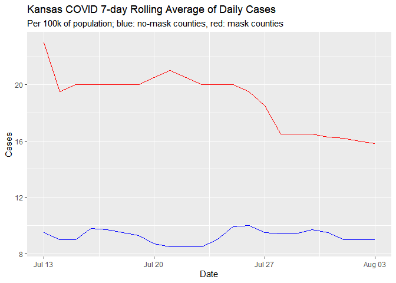

Lab 06 - Conveying the right message through visualisation
================
TEAM NAME

### Load packages and data

``` r
library(tidyverse) 
library(lubridate)
```

### Exercise 1

``` r
Covid_cases <- tribble(
  ~Date, ~Masks, ~No_Masks,
  "13/7/2020", 23, 9.5,
  "14/7/2020", 19.5, 9,
  "15/7/2020", 20, 9,
  "16/7/2020", 20, 9.8,
  "17/7/2020", 20, 9.7,
  "18/7/2020", 20, 9.5,
  "19/7/2020", 20, 9.3,
  "20/7/2020", 20.5, 8.7,
  "21/7/2020", 21, 8.5,
  "22/7/2020", 20.5, 8.5,
  "23/7/2020", 20, 8.5,
  "24/7/2020", 20, 9,
  "25/7/2020", 20, 9.9,
  "26/7/2020", 19.5, 10,
  "27/7/2020", 18.5, 9.5,
  "28/7/2020", 16.5, 9.4,
  "29/7/2020", 16.5, 9.4,
  "30/7/2020", 16.5, 9.7,
  "31/7/2020", 16.3, 9.5,
  "01/8/2020", 16.2, 9,
  "02/8/2020", 16, 9,
  "03/8/2020", 15.8, 9,
)
```

### Exercise 2

``` r
Covid_cases %>%
  mutate(Date = dmy (Date)) %>%
ggplot(aes(x = Date))+
  geom_line(aes(y = Masks),
            color = "red")+
  geom_line(aes(y = No_Masks),
            color = "blue")+
  labs(y = "Cases",
       title = "Kansas COVID 7-day Rolling Average of Daily Cases",
       subtitle = "Per 100k of population; blue: no-mask counties, red: mask counties")
```

<!-- -->

### Exercise 3

*Add your narrative here.*

### Exercise 4

*Add your narrative here.*
